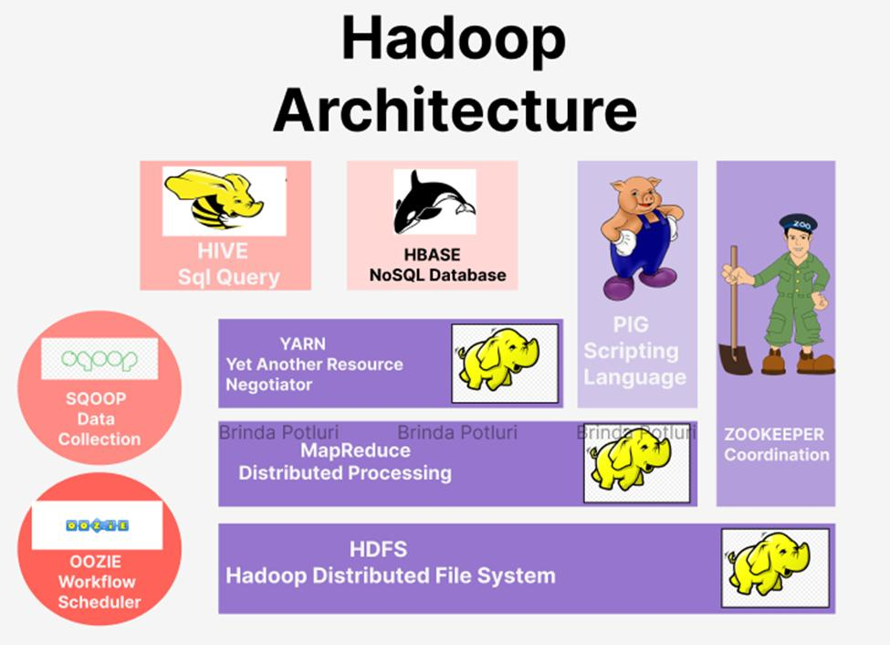
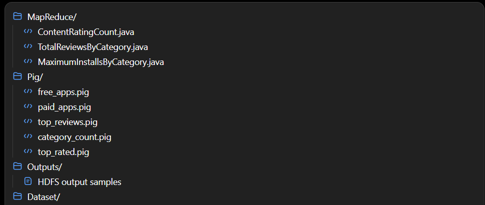

# Google Play Store Big Data Analytics

A Big Data Analytics project that analyzes the **Google Play Store Dataset** using **Apache Hadoop**, **Java MapReduce**, and **Apache Pig**. This project was developed as part of a university Big Data Analytics Laboratory course and demonstrates distributed data processing on a Hadoop single-node cluster.

## Project Overview

The Google Play Store dataset was uploaded to the Hadoop Distributed File System (HDFS) and analyzed using both Java MapReduce programs and Apache Pig scripts.

The project performs the following analyses:

- Count applications by content rating
- Calculate total reviews by category
- Find maximum installs by category
- Extract free applications
- Filter paid applications above $5
- Identify the top 10 most reviewed applications
- Count applications by category
- Filter highly rated applications (Rating ≥ 4.8)

## Hadoop Architecture

The project is built on the Hadoop ecosystem, where **HDFS** provides distributed storage, **MapReduce** performs distributed processing, and **Apache Pig** is used for high-level data analysis.

<p align="center">
  
</p>

## Technologies Used

- Apache Hadoop (HDFS)
- Java MapReduce
- Apache Pig
- Windows Single-Node Hadoop Cluster

## Project Structure

```text
BDA_Final_Project/
├── MapReduce/
│   ├── ContentRatingCount.java
│   ├── TotalReviewsByCategory.java
│   └── MaximumInstallsByCategory.java
├── Pig/
│   ├── free_apps.pig
│   ├── paid_apps.pig
│   ├── top_reviews.pig
│   ├── category_count.pig
│   └── top_rated.pig
├── Outputs/
├── Dataset/
├── Report/
│   └── Google_PlayStore_Big_Data_Project_Report.pdf
├── images/
│   ├── hadoop_architecture.png
│   └── project_structure.png
├── .gitignore
└── README.md
```

### Repository Structure Preview

The following image shows the actual project structure used in this repository.

<p align="center">
  
</p>

## Dataset

This project uses the **Google Play Store Apps Dataset** available on Kaggle.

| Item | Details |
|------|---------|
| Dataset | Google Play Store Apps |
| Source | Kaggle |
| Format | CSV |
| File Size | 676.46 MB |
| Columns | 24 |

**Dataset Link:**  
https://www.kaggle.com/datasets/gauthamp10/google-playstore-apps

> **Note:** The original dataset is not included in this repository because of its large file size (676.46 MB). Please download it from Kaggle before running the project.

## MapReduce Tasks

| Task | Description |
|------|-------------|
| MR1 | Content Rating Count |
| MR2 | Total Reviews by Category |
| MR3 | Maximum Installs by Category |

## Apache Pig Tasks

| Task | Description |
|------|-------------|
| Pig1 | Free Applications |
| Pig2 | Paid Applications Above $5 |
| Pig3 | Top 10 Most Reviewed Applications |
| Pig4 | Category-wise Application Count |
| Pig5 | Top Rated Applications (Rating ≥ 4.8) |

## HDFS Workflow

1. Create the input directory in HDFS.
2. Upload the dataset to HDFS.
3. Execute Java MapReduce programs.
4. Run Apache Pig scripts.
5. Store the generated outputs in `/PlayStoreProject/output`.

## Running the Project

### Upload Dataset to HDFS

```bash
hdfs dfs -mkdir -p /PlayStoreProject/input
hdfs dfs -put Google-Playstore.csv /PlayStoreProject/input/
```

### Run MapReduce Example

```bash
hadoop jar ContentRatingCount.jar ContentRatingCount \
/PlayStoreProject/input/Google-Playstore.csv \
/PlayStoreProject/output/MR1_ContentRatingCount
```

### Run Apache Pig Example

```bash
pig free_apps.pig
```

## Sample Outputs

The generated outputs are stored in HDFS under:

```text
/PlayStoreProject/output/
```

Example output folders:

- MR1_ContentRatingCount
- MR2_TotalReviewsByCategory
- MR3_MaximumInstallsByCategory
- Pig1_FreeApps
- Pig2_PaidAppsPriceAbove5
- Pig3_Top10MostReviewedApps
- Pig4_CategoryWiseAppCount
- Pig5_TopRatedApps

## Learning Outcomes

Through this project, I gained practical experience in:

- Working with HDFS for distributed storage.
- Developing Java MapReduce programs.
- Writing Apache Pig scripts.
- Processing large datasets using Hadoop.
- Managing Hadoop outputs.
- Troubleshooting Hadoop and Pig execution issues.

## References

1. Apache Hadoop – https://hadoop.apache.org
2. Apache Pig – https://pig.apache.org
3. Google Play Store Apps Dataset (Kaggle) – https://www.kaggle.com/datasets/gauthamp10/google-playstore-apps
4. Tom White, *Hadoop: The Definitive Guide*, 4th Edition.
5. Dean & Ghemawat, *MapReduce: Simplified Data Processing on Large Clusters*.

---

**Author:** Arnab

**Department:** Computer Science and Engineering

**Course:** Big Data Analytics Laboratory